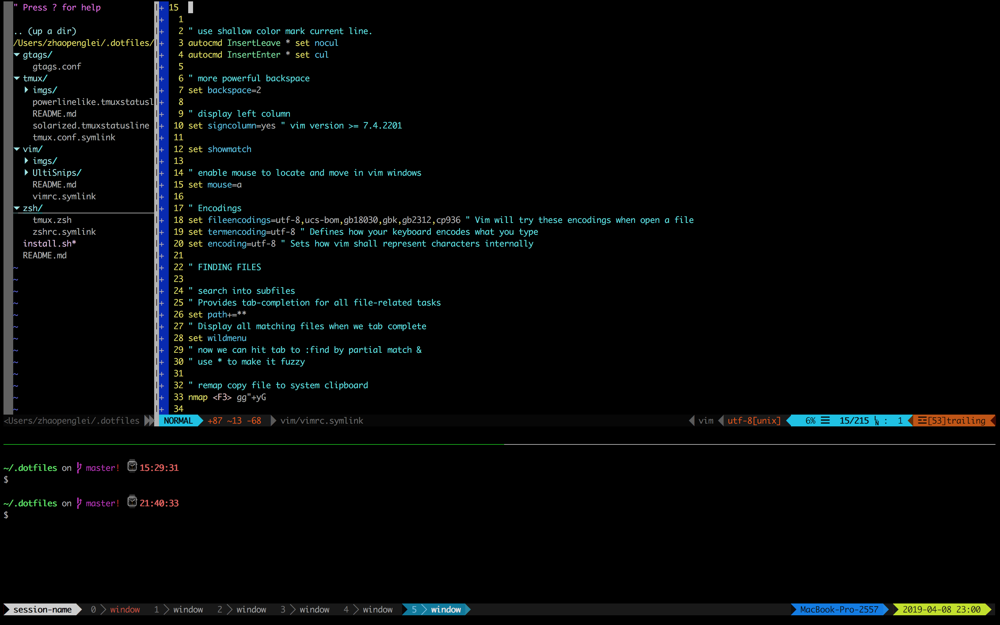

# Prerequisites

1. [install oh my zsh](https://ohmyz.sh/)

```
sh -c "$(curl -fsSL https://raw.github.com/ohmyzsh/ohmyzsh/master/tools/install.sh)"
```

2. `sudo yum install autojump`

3. [install tmux](https://github.com/tmux/tmux/wiki)
   - version = 3.1b
   - download from [galaxy](http://galaxy4.net/repo/)
   - rpm -ivh *.rpm


# Installation

```bash
$ git clone https://github.com/FriendLey/dotfiles_linux.git ~/.dotfiles
$ cd ~/.dotfiles
$ ./install.sh
```

# [install powerline font](https://github.com/powerline/fonts)
