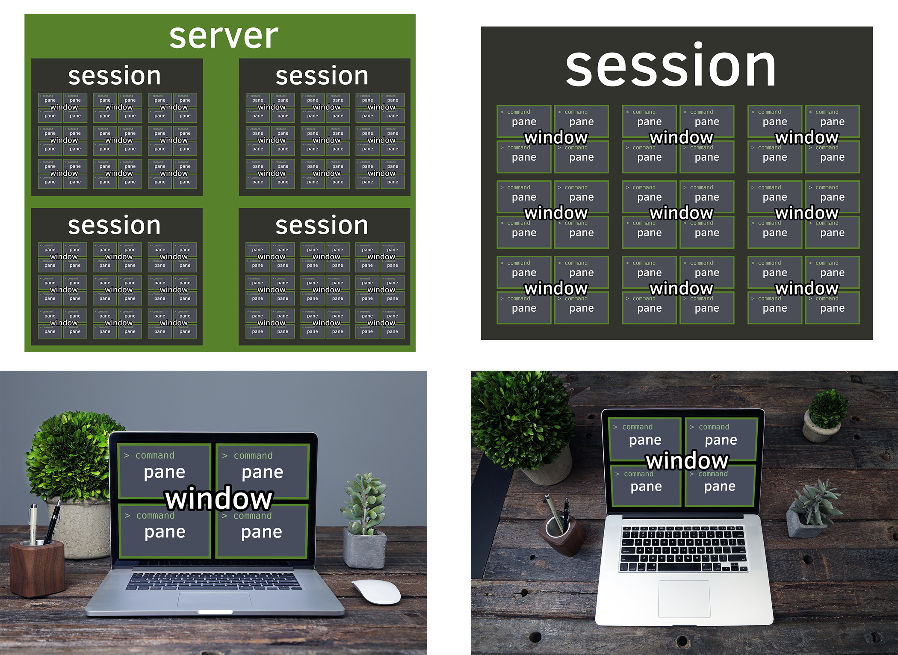

[TOC]

# tmux

**T**erminal **Mu**ltiple**x**er




# server

开启一个server：

```shell
tmux
```

关闭server：

```shell
tmux kill-server # 关闭server，所有的会话都会关闭
```

# session

新建一个session：

- `-s`    -- name the session	

```shell
tmux # 新建一个无名称的会话
tmux new -s <session-name> # 新建一个session-name的会话
tmux new-session -s <session-name> # 新建一个session-name的会话
```

断开当前session：`ctrl b d`  **[下次还能接着用]**

```shell
tmux detach # 断开当前会话，会话在后台运行
```

进入之前的session：

- `-t`    -- specify target session

```shell
tmux a # 默认进入第一个会话
tmux a -t <session-name> # 进入名称为<session-name>的会话
tmux attack-session -t <session-name> # 进入名称为<session-name>的会话
```

关闭session：

- `-t`    -- specify target session

```
tmux kill-session -t <session-name>
```

# windows

windows的操作一般通过shortcuts来操作

# pane

pane的操作一般通过shortcuts来操作

# shortcuts

- system shortcuts

| Prefix | Shortcuts | description            |
| ------ | --------- | ---------------------- |
| Ctrl+b | ?         | List all key bindings. |

- Session shortcuts

| Prefix | Shortcuts | description                                                 |
| ------ | --------- | ----------------------------------------------------------- |
| Ctrl+b | d         | Detach the current client.                                  |
| Ctrl+b | D         | Choose a client to detach.                                  |
| Ctrl+b | Ctrl+z    | Suspend the tmux client.                                    |
| Ctrl+b | r         | Force redraw of the attached client.                        |
| Ctrl+b | s         | Select a new session for the attached client interactively. |
| Ctrl+b | :         | Enter the tmux command prompt.                              |
| Ctrl+b | [         | Enter copy mode to copy text or view the history.           |
| Ctrl+b | ]         | Paste the most recently copied buffer of text.              |
| Ctrl+b | ~         | Show previous messages from tmux, if any.                   |

- window shortcuts

| Prefix | Shortcuts | Description                                     |
| ------ | --------- | ----------------------------------------------- |
| Ctrl+b | c         | Create a new window.                            |
| Ctrl+b | ,         | Rename the current window.                      |
| Ctrl+b | p         | Change to the previous window.                  |
| Ctrl+b | n         | Change to the next window.                      |
| Ctrl+b | 0 to 9    | Select windows 0 to 9.                          |
| Ctrl+b | w         | Choose the current window interactively.        |
| Ctrl+b | .         | Prompt for an index to move the current window. |
| Ctrl+b | f         | Prompt to search for text in open windows.      |
| Ctrl+b | &         | Kill the current window.                        |


- pane shortcuts

| Prefix | Shortcuts                                 | Description                                                  |
| ------ | ----------------------------------------- | ------------------------------------------------------------ |
| Ctrl+b | %                                         | Split the current pane into two, left and right.             |
| Ctrl+b | "                                         | Split the current pane into two, top and bottom.             |
| Ctrl+b | Ctrl+Up, Ctrl+Down, Ctrl+Left, Ctrl+Right | Resize the current pane in steps of one cell.                |
| Ctrl+b | Alt+Up, Alt+Down, Alt+Left, Alt+Right     | Resize the current pane in steps of five cells.              |
| Ctrl+b | Ctrl+o                                    | Rotate the panes in the current window forwards.             |
| Ctrl+b | Up, Down, Left, Right                     | Change to the pane above, below, to the left, or to the right of the current pane. |
| Ctrl+b | o                                         | Select the next pane in the current window.                  |
| Ctrl+b | ;                                         | Move to the previously active pane.                          |
| Ctrl+b | {                                         | Swap the current pane with the previous pane.                |
| Ctrl+b | }                                         | Swap the current pane with the next pane.                    |
| Ctrl+b | z                                         | Toggle zoom state of the current pane.                       |
| Ctrl+b | !                                         | Break the current pane out of the window.                    |
| Ctrl+b | x                                         | Kill the current pane.                                       |
| Ctrl+b | q                                         | Briefly display pane indexes.                                |
| Ctrl+b | Space                                     | Arrange the current window in the next preset layout.        |
| Ctrl+b | t                                         | Show the time.                                               |


# ~/.tmux.conf

```bash
# for accustom panel/window name.
set-option -g allow-rename off

# for mouse to scroll up and down.
set -g mouse on
```

注意事项：

- 使用`set -g mouse on`这个属性可以看到屏幕的历史内容，但是iterm2的选中复制功能没法使用了。解决方法：鼠标选中的时候按住option键 cmd+v可以正常粘贴。


