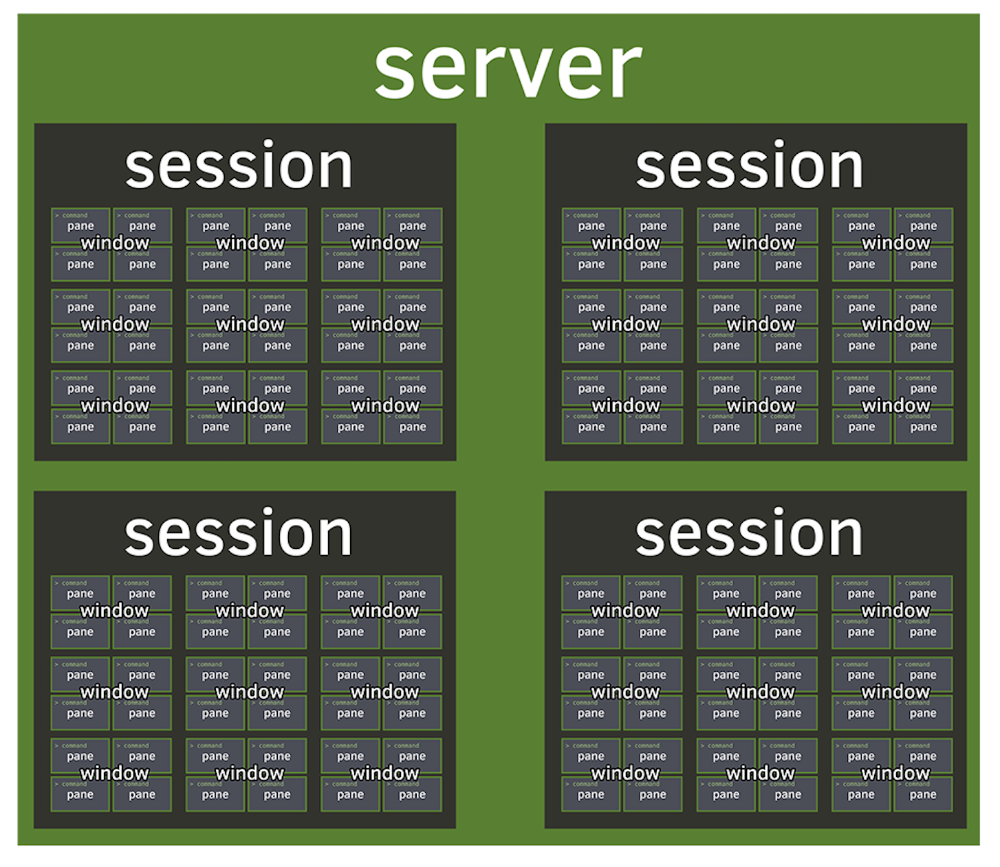

[TOC]

# tmux 安装

Installing Tmux on macOS: 

```shell
brew install tmux
```

Installing Tmux on Ubuntu and Debian: 

```shell
sudo apt install tmux
```

Installing Tmux on CentOS and Fedora: 

```shell
sudo yum install tmux
```

# tmux 简介

Tmux（**T**erminal **Mu**ltiple**x**er）是一个终端复用软件。一个 tmux **server** 包含多个**session**（会话）；每个session包含多个**window**（窗口）；每个window包含多个**pane**（面板）。其结构如下图所示：




tmux采用C/S模型构建，输入**tmux**命令就相当于开启了一个服务器，此时默认将新建一个会话，会话中默认新建一个窗口，窗口中默认新建一个面板。接下来就进入了tmux的server内部。在内部，向tmux发出指令时需要使用前缀，tmux默认的前缀是`ctrl b`。之后的操作与vim颇为相似，tmux有两种模式：

- normal模式：使用 `<prefix> + shortcut` 对session，window，pane进行操作

- 命令行模式：使用 `<prefix> + :` 进入命令行模式，之后输入相关命令对session，window，pane进行操作。所有命令行模式的操作都可以在tmux server的外部显式地调用tmux进行操作。比如下面两种新建一个session的操作是等价的：

  ```shell
  <prefix> : new -s <session-name> # tmux server 内部
  tmux new -s <session-name> # 在外部终端使用
  ```

# tmux 操作

## server 

| 命令                     | 描述              |
| ------------------------ | ----------------- |
| \<prefix\> : kill-server | 关闭所有会话      |
| \<prefix\> ?             | 列出所有 bind-key |

## session

| 命令                                            | 描述                                       |
| ----------------------------------------------- | ------------------------------------------ |
| \<prefix\> : new-session -s \<session-name\>    | 新建名称为session-name的会话 并 进入该会话 |
| \<prefix\> d<br />\<prefix\> : detach           | 脱离当前会话（还能重新进入该会话）         |
| \<prefix\> : attach-session -t \<session-name\> | 重新进入名称为session-name的会话           |
| \<prefix\> s                                    | 列出当前server中的所有会话                 |
| \<prefix\> $                                    | 重命名当前会话                             |
| \<prefix\> : kill-session -t \<session-name\>   | 关闭名称为session-name的会话（永久关闭）   |

## window

| 命令             | 描述                         |
| ---------------- | ---------------------------- |
| \<prefix\> c     | 新建一个window               |
| \<prefix\> ,     | 重命名当前window             |
| \<prefix\> p     | 切换到前一个window           |
| \<prefix\> n     | 切换到后一个window           |
| \<prefix\> [0-9] | 选择 window [0-9]            |
| \<prefix\> w     | 列出当前server中的所有window |
| \<prefix\> .     | 移动当前window               |
| <prefix\> f      | 查找window                   |
| <prefix\> &      | 关闭当前window               |

## pane

| 命令                                                         | 描述                                     |
| ------------------------------------------------------------ | ---------------------------------------- |
| <prefix\> %                                                  | 竖直分割当前pane                         |
| <prefix\> "                                                  | 水平分割当前pane                         |
| <prefix\> z                                                  | 将当前pane放大到整个window（重复可返回） |
| \<prefix\> o                                                 | 选择当前window的下一个pane               |
| <prefix\> [l;]                                               | 选择前一个pane                           |
| <prefix\> {                                                  | 将当前pane与前一个pane交换               |
| <prefix\> }                                                  | 将当前pane与后一个pane交换               |
| <prefix\> \<ctrl\> o                                         | 逆时针旋转当前window的所有pane           |
| <prefix\> \<ctrl\> O                                         | 顺时针旋转当前window的所有pane           |
| \<prefix\> t                                                 | 在当前pane显示当前时间                   |
| \<prefix\> [$\leftarrow \downarrow \uparrow \rightarrow$]    | 移动到[左下右上]的pane                   |
| \<prefix\> \<ctrl\> [$\leftarrow \downarrow \uparrow \rightarrow$] | 以 1 cell 为单位改变当前pane的大小       |
| \<prefix\> \<alt\> [$\leftarrow \downarrow \uparrow \rightarrow$] | 以 5 cell 为单位改变当前pane的大小       |
| \<prefix\> !                                                 | 新建一个窗口，并将当前pane移动过去       |
| \<prefix\> p                                                 | 显示当前window的各个pane的序号           |
| \<prefix\> \<space\>                                         | 重新对当前window的各个pane进行排版       |
| \<prefix\> x                                                 | 关闭当前pane                             |

# tmux 快捷键配置

- 添加 \<ctrl\> a 前缀

  ```shell
  set -g prefix2 C-a
  bind C-a send-prefix -2
  ```

  配置之后，`ctrl a` 和 `ctrl b` 均为前缀

- 激活鼠标滚动

  ```shell
  set -g mouse on
  ```

- 设置 `<prefix> r` 热更新当前运行的tmux server的配置

  ```shell
  bind r source-file ~/.tmux.conf \; display "Config Reloaded!"
  ```

  修改配置文件后，可以直接tmux内部 `<prefix> r` 更新当前tmux server的配置

- 设置`<prefix> [-|]` 水平竖直分割pane

  ```shell
  bind | split-window -h -c "#{pane_current_path}"
  bind - split-window -v -c "#{pane_current_path}"
  ```

- 设置 `<prefix> y` 同步操作所有pane

  ```shell
  bind y setw synchronize-panes
  ```

- 设置 `<prefix> [HJKL]` 改变pane的大小

  ```shell
  bind -r H resize-pane -L 2
  bind -r J resize-pane -D 2
  bind -r K resize-pane -U 2
  bind -r L resize-pane -R 2
  ```

- 设置 `<prefix> [hjkl]` 在当前window的不同pane之间移动

  ```shell
  bind -r h select-pane -L 
  bind -r l select-pane -R
  bind -r j select-pane -D
  bind -r k select-pane -U
  ```

- 设置 `<prefix> C-c` 创建新的session

  ```shell
  bind C-c new-session
  ```

- 设置 `<prefix> C-f` 查找并切换到某个session

  ```shell
  bind C-f command-prompt -p find-session 'switch-client -t %%'
  ```

- 设置 `<prefix> C-l` 清空当前pane的屏幕及历史

  ```shell
  bind -n C-l send-keys C-l \; run 'sleep 0.1' \; clear-history
  ```

# tmux 状态栏设置

在此dotfiles里包含两个状态栏设置（tmux.conf.symlink文件里）：

```shell
source-file $HOME/.dotfiles/tmux/solarized.tmuxstatusline
# source-file $HOME/.dotfiles/tmux/powerlinelike.tmuxstatusline
```

solarized 主题：


powerline-like主题（需要 [powerline-font](https://github.com/powerline/fonts)）：


